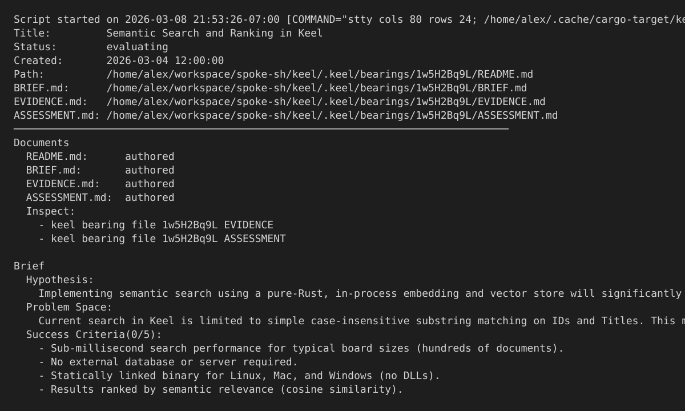

# VOYAGE REPORT: Evidence-Backed Assessment and Surfaces

## Voyage Metadata
- **ID:** 1vzQu5000
- **Epic:** 1vzQpr000
- **Status:** done
- **Goal:** -

## Execution Summary
**Progress:** 3/3 stories complete

## Implementation Narrative
### Make Bearing Assessment Evidence-Aware And Compute EV Scores
- **ID:** 1vzQwq000
- **Status:** done

#### Summary
Make `ASSESSMENT.md` citation-aware and evolve EV scoring so the recommendation path is grounded in traceable evidence quality signals such as breadth, freshness, authority, and contradiction handling instead of relying only on authored judgment fields.

#### Acceptance Criteria
- [x] [SRS-01/AC-01] `ASSESSMENT.md` requires canonical evidence citations for findings, dependencies, alternatives, and recommendations so assessment claims are traceable to stored source IDs. <!-- verify: cargo test -p keel bearing_assessment_requires_evidence_citations, SRS-01:start:end, proof: ac-1.log-->
- [x] [SRS-02/AC-01] EV scoring incorporates evidence breadth, freshness, authority, and contradiction or gap handling alongside authored impact, confidence, effort, and risk factors. <!-- verify: cargo test -p keel bearing_ev_score_uses_evidence_quality_signals, SRS-02:start, proof: ac-2.log-->
- [x] [SRS-02/AC-02] Fixture scenarios prove that stronger or weaker evidence meaningfully changes computed assessment and EV outcomes. <!-- verify: cargo test -p keel bearing_ev_score_changes_with_evidence_quality, SRS-02:continues, proof: ac-3.log-->
- [x] [SRS-02/AC-03] [SRS-NFR-01/AC-01] Equivalent evidence inputs and authored assessment factors always produce identical scores and ordering. <!-- verify: cargo test -p keel bearing_ev_score_is_deterministic, SRS-NFR-01:start:end, SRS-02:end, proof: ac-4.log-->

#### Verified Evidence
- [ac-1.log](../../../../stories/1vzQwq000/EVIDENCE/ac-1.log)
- [ac-2.log](../../../../stories/1vzQwq000/EVIDENCE/ac-2.log)
- [ac-3.log](../../../../stories/1vzQwq000/EVIDENCE/ac-3.log)
- [ac-4.log](../../../../stories/1vzQwq000/EVIDENCE/ac-4.log)

### Render Evidence-Backed Bearing Show And File Surfaces
- **ID:** 1vzQwr000
- **Status:** done

#### Summary
Render evidence-backed bearing reading surfaces so operators can inspect citations and provenance directly in the terminal without losing access to the underlying evidence document.

#### Acceptance Criteria
- [x] [SRS-04/AC-01] `bearing show` renders compact provenance and citation summaries that support terminal review without dropping the underlying evidence context. <!-- verify: cargo test -p keel bearing_show_renders_compact_evidence_provenance, SRS-04:start, proof: ac-1.log-->
- [x] [SRS-04/AC-02] `bearing file` and related drill-down affordances make the underlying `EVIDENCE.md` document directly accessible from the terminal workflow. <!-- verify: cargo test -p keel bearing_file_surfaces_evidence_document, SRS-04:continues, proof: ac-2.log-->
- [x] [SRS-04/AC-03] [SRS-NFR-02/AC-01] Default terminal rendering keeps provenance readable at common terminal widths without forcing raw-file inspection for routine review. <!-- verify: vhs tapes/bearing-evidence-surfaces.tape, SRS-NFR-02:start:end, SRS-04:end, proof: ac-3.log-->

#### Verified Evidence
- [ac-1.log](../../../../stories/1vzQwr000/EVIDENCE/ac-1.log)
- [ac-2.log](../../../../stories/1vzQwr000/EVIDENCE/ac-2.log)

- [ac-3.log](../../../../stories/1vzQwr000/EVIDENCE/ac-3.log)

### Gate Readiness And Board Projections On Evidence Quality
- **ID:** 1vzQws000
- **Status:** done

#### Summary
Gate bearing readiness on evidence quality and expose that state in board projections so incomplete or weakly supported research is visible before a bearing is treated as decision-ready.

#### Acceptance Criteria
- [x] [SRS-03/AC-01] `keel doctor` and readiness gates block bearings whose evidence coverage, citation quality, or contradiction handling do not satisfy the decision-ready contract. <!-- verify: cargo test -p keel bearing_readiness_requires_evidence_quality, SRS-03:start, proof: ac-1.log-->
- [x] [SRS-03/AC-02] Bearing list, flow, and related projections surface evidence-backed readiness and score outputs so weak research is visible in board views. <!-- verify: cargo test -p keel bearing_projections_surface_evidence_quality, SRS-03:continues, proof: ac-2.log-->
- [x] [SRS-03/AC-03] Recovery guidance points operators toward missing evidence or citation work rather than generic document-presence checks. <!-- verify: cargo test -p keel bearing_readiness_guidance_targets_missing_evidence, SRS-03:end, proof: ac-3.log-->

#### Verified Evidence
- [ac-1.log](../../../../stories/1vzQws000/EVIDENCE/ac-1.log)
- [ac-2.log](../../../../stories/1vzQws000/EVIDENCE/ac-2.log)
- [ac-3.log](../../../../stories/1vzQws000/EVIDENCE/ac-3.log)

