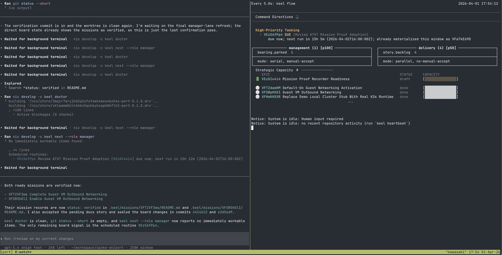
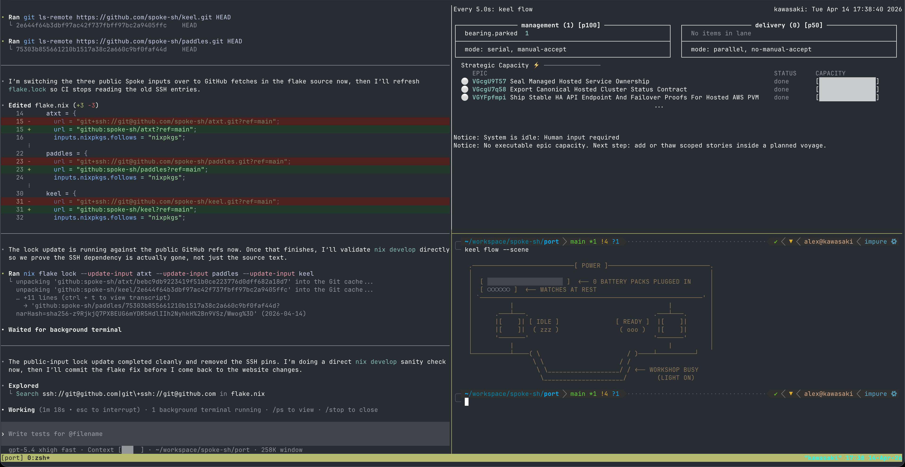
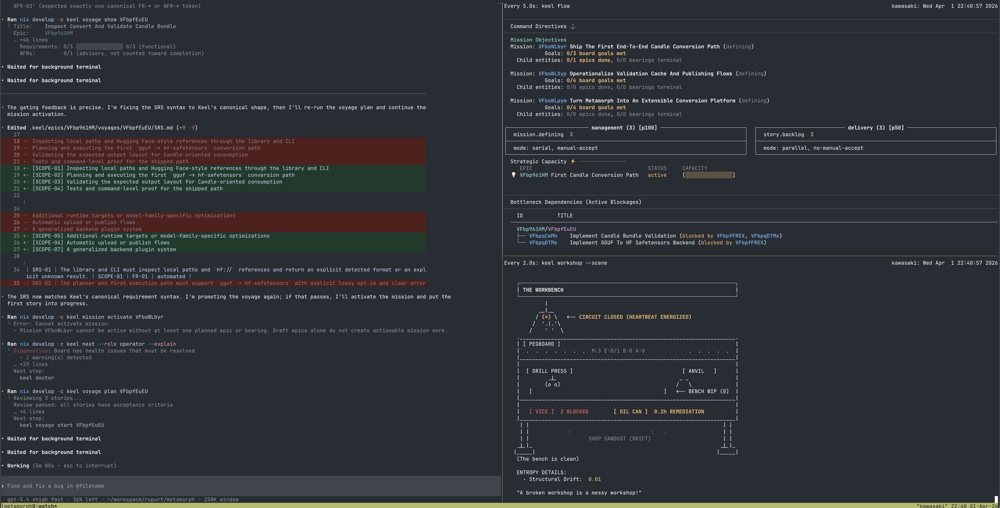

# Keel: The Agentic Board Engine

> **Turn-based board engine for human/AI delivery teams.**

[](https://github.com/spoke-sh/keel/blob/main/.keel/README.md)
[](https://github.com/spoke-sh/keel/actions/workflows/ci.yml)

Welcome to Keel. This is not a notes app with automation bolted on; it is a board engine designed for the era of human-agent collaboration. Keel treats software development as a high-fidelity operating system where **Formal Rules** act as the physics, **Turns** are the unit of progress, and **Play** remains a first-class tool for discovery.

<p align="center">
  
  
  
</p>

---

## Installation

### Homebrew (macOS and Linux)

```bash
brew tap spoke-sh/tap
brew install keel
```

### One-liner Install (macOS and Linux)

```bash
curl --proto '=https' --tlsv1.2 -LsSf https://github.com/spoke-sh/keel/releases/latest/download/keel-installer.sh | sh
```

### Nix (Anywhere)

```bash
nix run github:spoke-sh/keel
```

### Upgrade an Existing Install

```bash
keel upgrade
keel upgrade --ref v0.1.0
```

### Manual Download

Download the latest pre-built binaries and installers for your platform from the [GitHub Releases](https://github.com/spoke-sh/keel/releases) page. We provide:
- **Linux:** `.tar.gz` archives plus the cross-platform shell installer
- **macOS:** `.tar.gz` archives plus the cross-platform shell installer
- **Windows:** `.zip` archives, `.msi`, and the PowerShell installer

---

## 🎮 The Ramping Path

Keel is designed to meet you where you are in your journey of comprehension. As you interact with the engine, you naturally level up through three distinct roles:

### 1. The Fixer (Learning by Healing)
**Comprehension:** Low
**The Move:** `keel doctor`
Start here. The engine will tell you exactly where the board is "broken" (Scaffold Drift, Structural Drift). By fixing these objective issues, you learn the structural invariants of the system without needing to understand the full architecture yet.

### 2. The Operator (Learning by Building)
**Comprehension:** Medium
**The Move:** `keel turn`
Once the board is healthy, you move into the canonical **Turn Loop**. You orient, inspect, pull, ship, and close one visible state change at a time. You learn how requirements flow from planning into verified code.

### 3. The Architect (Learning by Constraining)
**Comprehension:** High
**The Move:** `keel adr new` / `keel voyage plan`
At the highest level, you define the physics of the sandbox. You author the Architecture Decision Records (ADRs) and tactical plans (SRS/SDD) that constrain how agents and other operators execute.

---

## 🎭 Discovery through Play

We believe that planning should be preceded by exploration. Keel encourages **Play** as a first-class citizen to reduce the "fog of war" before requirements are frozen.

- Use `keel play --theater` to launch narrative discovery sessions.
- Cross-pollinate ideas with `keel play --cross <id1> <id2>`.
- Let the **Theater Personas** (Shakespeare, Stand-up, Action) help you look at a technical problem through a different mask.

---

## ⚙️ Technical Core

### The Turn Loop
The canonical operating rhythm is:

- **Orient**: `keel turn`, `keel heartbeat`, `keel health --scene`, `keel flow --scene`, `keel doctor`
- **Inspect**: `keel mission next --status`, `keel pulse`
- **Pull**: `keel roles`, `keel next --role <role>`, `keel next --role <role> --explain`
- **Ship**: `keel story start <id>`, `keel story record <id>`, `keel story submit <id>`
- **Close**: `keel story accept <id> --role manager` or the equivalent planning transition plus a sealing commit

`keel flow` is the readiness surface, not a second copy of `keel doctor`. It short-circuits on blocking doctor failures, but while the heartbeat is energized it can keep the circuit open during active mission intake when the only errors are transitional mission-wiring debt such as missing children or no in-flight work.

### Role Routing & Lanes
The engine uses a 2-lane pull model to prevent strategic fog:

- **MANAGEMENT LANE**: `keel next --role manager` returns management-lane decisions and never returns implementation `Work`.
- **DELIVERY LANE**: `keel next --role operator` returns implementation work from the delivery lane (`in-progress` then `backlog`).

Use `keel roles` to inspect the resolved lane topology and `keel next --role <role> --explain` to understand why a role pulls from a particular lane.

**Constraint**: `keel next` requires `--role`; there is no implicit manager default.

### Key Engine Commands
```text
turn        Inspect the canonical Orient/Inspect/Pull/Ship/Close loop
next        Pull the next item using explicit role-based queue routing
roles       Show resolved roles, lanes, and operational contracts
flow        Show workflow lane dashboard from configured topology
doctor      Validate board health and optionally fix issues
```

### Keeper, External Ingress, and Multiplayer Boundaries
Keel's day-one path is still direct board work through `mission`, `epic`,
`voyage`, and `story` commands. When Keel is embedded inside a larger runtime
such as Keeper, the boundary should stay explicit:

- Keel owns planning truth and board artifacts.
- Keeper owns provider ingress, routing, execution, and replay.
- External requests should normalize into a provider-neutral mission request
  envelope instead of mutating `.keel` state out-of-band.
- The first documented provider shape is a GitHub issue whose title begins
  `Keel Mission Request:`.
- The documented direction is a native `keel mission request ...` command family
  for parse, validate, draft, apply, and acknowledgement composition.
- Stronger multiplayer guarantees belong at the boundary through
  backend-agnostic audit proofs and high-consequence attestation, not as a
  requirement for every local turn.

See [ARCHITECTURE.md](ARCHITECTURE.md) and [PROTOCOL.md](PROTOCOL.md) for the
foundational contract.

## ⚖️ The Physics: Formal Rules

Keel is governed by a strict set of operational invariants. These rules ensure that as the simulation grows in complexity, it never drifts into chaos.

### Document Hierarchy
Use this order when authoring or reviewing decisions:
1. ADRs (`.keel/adrs/`) — binding architectural decisions
2. [CONSTITUTION.md](CONSTITUTION.md) — collaboration philosophy and governance intent
3. [POLICY.md](POLICY.md) — operational invariants and engine constraints
4. [ARCHITECTURE.md](ARCHITECTURE.md) — implementation structure and technical constraints
5. [CONFIGURATION.md](CONFIGURATION.md) — role-based and config-driven topology
6. [RELEASE.md](RELEASE.md) — release capabilities and overview
7. Planning artifacts (`PRD.md` → `SRS.md`/`SDD.md` → story `README.md`) — scoped executable work

- **[AGENTS.md](AGENTS.md)**: The turn loop and operator contract for AI contributors.

---

## 🚀 Quick Start

1. **Install:** `nix run github:spoke-sh/keel`
2. **Orient:** `keel turn`
3. **Inspect:** `keel mission next --status`
4. **Pull:** `keel next --role manager` or `keel next --role operator`
5. **Ship & Close:** move one slice, record proof, and land the sealing commit

Release-installer installs can be refreshed with `keel upgrade`. If you need a specific upstream tag or commit instead of the latest published release, use `keel upgrade --ref <tag-or-sha>`.

**Everything flows down:** Vision → Epic → Voyage → Story → Implementation.
**Everything loops back:** Reflection → Knowledge → Patterns → Bearings → Architecture.

---

*"The goal is not to automate humans out of the loop, but to place human judgment where it is irreplaceable."*
